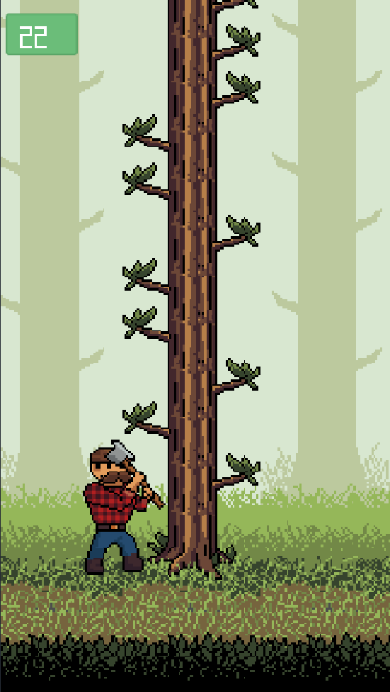

# 🌲 Cut Down That Tree

**Cut Down That Tree** is a simple and addictive **retro-style pixel art** game where your goal is to chop down an infinite tree without getting hit by its branches.

🎮 *Quick reflexes. Endless challenge. Pure fun.*

---

## 🪓 Gameplay

You're a rugged lumberjack with one job: **cut the tree as fast as you can**.  
Branches grow on both sides — if you chop into one, it’s game over!

**Controls:**
- Tap/click (or press left/right) to chop and switch sides.
- Avoid the branches.
- Try to beat your high score!

---

## ✨ Features

- 🎨 Retro **pixel art** visuals  
- 🕹️ Simple, intuitive controls  
- 🌳 **Endless tree** with random branch generation  
- 🔊 Cartoon-style sound effects and background music  
- 🛠️ Built with **Godot 4.4**  
- 🧩 Completely **free** and **open source**  
- ❌ No ads, no data collection, no nonsense  

---

## 📷 Screenshots




---

## 🧑‍💻 Tech Stack

- **Engine:** [Godot 4.4](https://godotengine.org)  
- **Language:** GDScript  
- **Assets:** Custom-made pixel art and effects  

---

## 🚀 Getting Started

To run the game locally:

```bash
git clone https://github.com/yourusername/cut-down-that-tree.git

```
Then open the project in Godot 4.4 and press Play ▶️

---

## 📄 License

This project is licensed under the MIT License.
See the [LICENSE](./LICENSE.txt) file for details.

---

## 💬 Feedback & Contributions

Found a bug? Want to add a new feature or improve something?
Feel free to open an issue or submit a pull request! 💡
We welcome contributions from everyone. 😊

---

## 📬 Contact

If you have any questions, feel free to contact me at:
📧 <jcodingeverything@gmail.com>